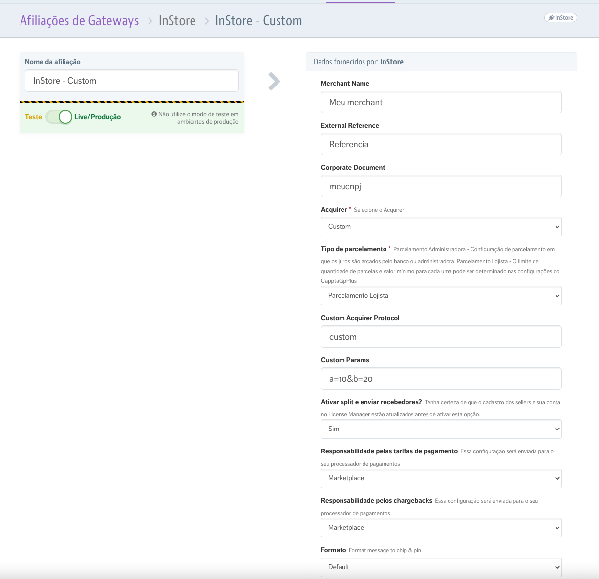
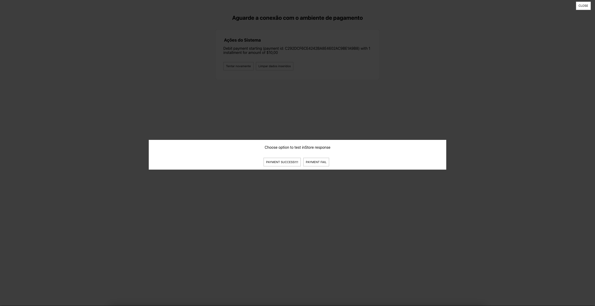

# inStore Custom Windows payment

This project is a template to create your own IO App as a payment conector interface for VTEX inStore on Windows.

## Creating your own provider on VTEX Gateway

The first step is to create an inStore conector using the value "Custom" as your acquirer:



The fields "Custom Acquirer Protocol" and "Custom Params" is what will define your provider namespace and its fixed configurations that will also be passed to you on the `params` object that this project's `react/index.tsx` defines.

You also need to create instances on payment conditions tab of VTEX Gateway for inStore debit and credit areas to point to this conector, see more details on how to do this [here](https://help.vtex.com/tracks/instore-payments--43B4Nr7uZva5UdwWEt3PEy/2liigRors32hzqBNs2M1Oa).

After the integration is done with this "Custom" provider, you should ask VTEX to create your Acquirer as a fixed option.

## Creating your own provider UI

After you configured your conector to be used on inStore, copy this repository by click on the "Use this template" button here on github and choosing your own organization and name.


## Configure your provider UI

### Setup your route

You need to change the path on `store/routes.json` from "/checkout/instore-custom" to "/checkout/instore-{{The acquirer protocol you inserted on the conector field}}"

### Setup your app name

You also need to change on your `manifest.json` to have your "vendor" and "name" correctly so it is a unique app on the VTEX ecossystem.

### Setup VTEX Cli and link project

Install the [VTEX IO CLI](https://developers.vtex.com/vtex-developer-docs/docs/vtex-io-documentation-vtex-io-cli-installation-and-command-reference) if you don't already have it.

You also need to have permission on the VTEX Account named `instore`.

After that, login and link this project on a workspace (I will call my workspace "example"):

```bash
vtex login instore
vtex use example
vtex link
```

### Setup inStore configuration with your workspace

To let inStore know your workspace exist you must add a key named "workspace" and a value to the applinking extra parameters.

This happens on inStore JS configurations that exist on the portal area of VTEX Admin in the path: `https://{{accountname}}.myvtex.com/admin/portal/#/sites/default/code/files/checkout-instore-custom.js`

Like this [example](https://github.com/vtex/checkout-instore-custom/blob/master/add-extra-params-on-applinking.js) shows, for that you need to configure on the global `INSTORE_CONFIG` variable on this admin file like this:

```js
window.INSTORE_CONFIG = {
  // ...
  applinkingPayloadExtraFields: {
    // ...
    workspace: "example"
  },
}

```

## Test on inStore

Open the inStore windows application (download it from [here](https://help.vtex.com/instorewin)) and set it up to your account name (more instructions [here](https://help.vtex.com/pt/tracks/instore-setup)).

Create a new cart and select debit or credit in order to pay on it.

You should see a screen like this:



Where you can see what happens when you give inStore a success or a fail response.

You can also edit any file on this repo after linked to your workspace and see that it updates with hot reloading, like on this video:


https://user-images.githubusercontent.com/1321766/118196755-f0b23d00-b423-11eb-91a2-601548c25d29.mp4


## Edit the code

It all starts on the `react/index.tsx` file. If you wan't to use react as your UI solution maintain Root component's `useEffect` and replace the `start` function with any custom Component and `useState` calls you want.

If you already have or wan't to use any other JS / TS solution, see the `start` function on the `react/index.tsx` and the `react/payment/index.ts` to understand this example that creates a popup on the interface as an UI structure.

Also see the `react/params.ts` file and include any other param on `PaymentParams` type that you included on your conector.

The `getParamsFromCurrentUrl` and `listenForNewParams` functions of `react/params.ts` is what will give you the params you need to do the payment or refund flow on the first and on further inStore calls, respectively. It uses the `PaymentParams` or `RefundParams` types to inform you what you can use to do execute the call.

The `sendResponse` function of `react/params.ts` is what you will use to send the response back to inStore and the `ResponsePaymentData` and `ResponseRefundData` are the types that contains what you need to inform inStore so the integration works.

We recommend you to create an interface (with any JS / TS technology you want) that pops up and connects to any server (local on Windows or remote) with websocket (or any other layer you believe make sense) and that actually make the payment or refund flow, informing the Sales Associate of every step of the way.

## Deploy the integration

After the integration is done, you can remove the `workspace` configuration on the inStore configuration on admin and deploy the solution.

Use the VTEX IO Cli for this deploy with these commands:
```bash
vtex release patch stable
vtex workspace reset -p
vtex install
vtex workspace promote
vtex deploy
```
